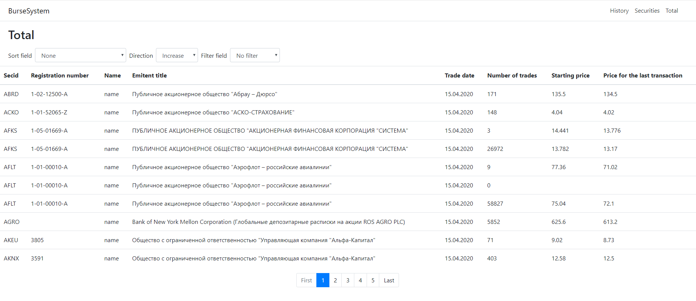
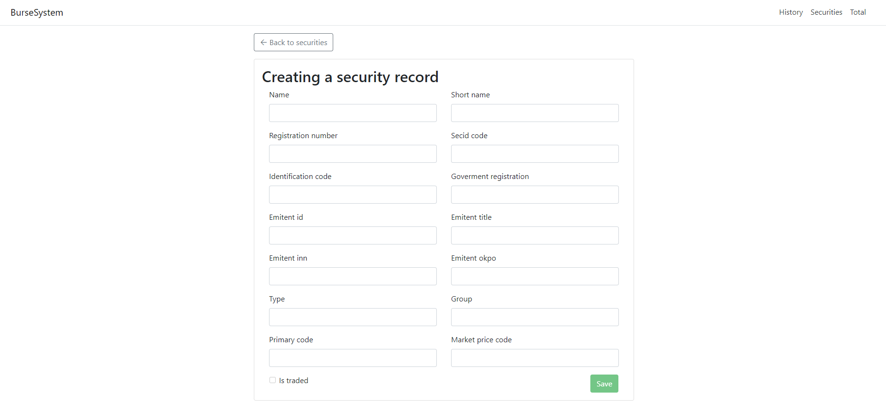
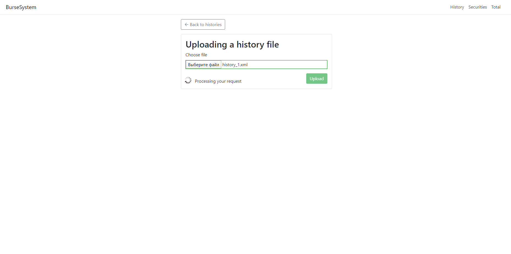

A service that displays information about securities and exchange histories stored in the database. The user can upload data from the corresponding xml file or add it manually. You can sort and filter data in the resulting table. The front end is implemented using the Angular framework.

